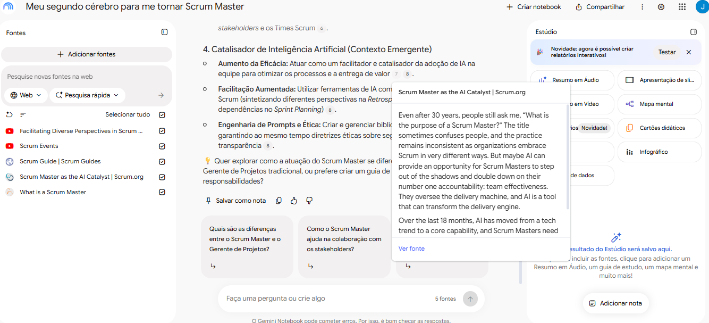
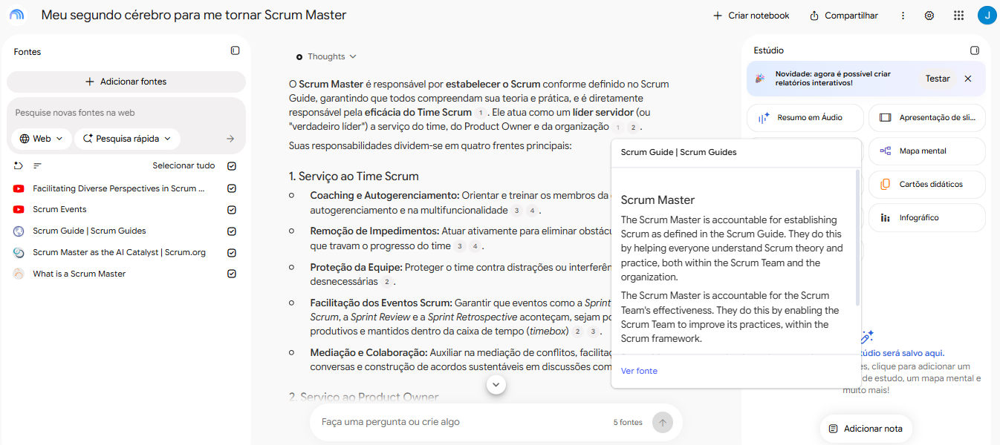
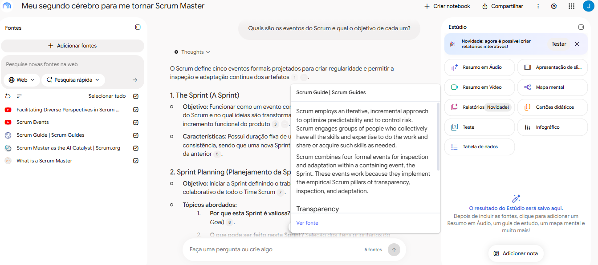
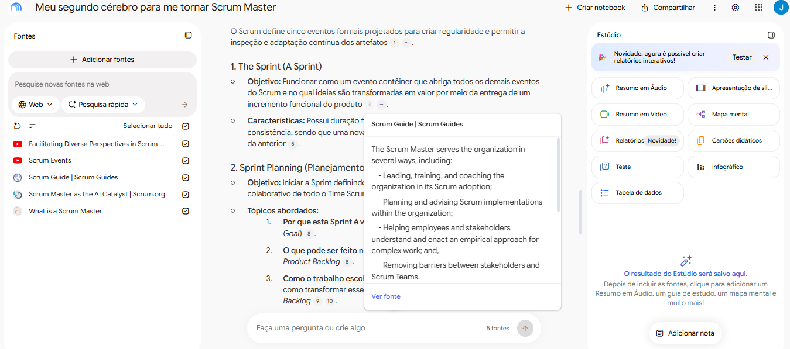
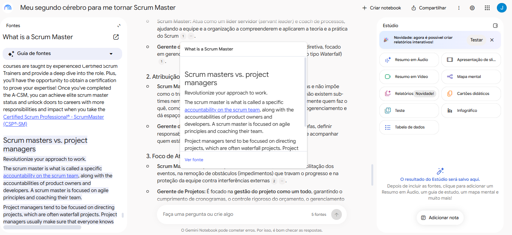
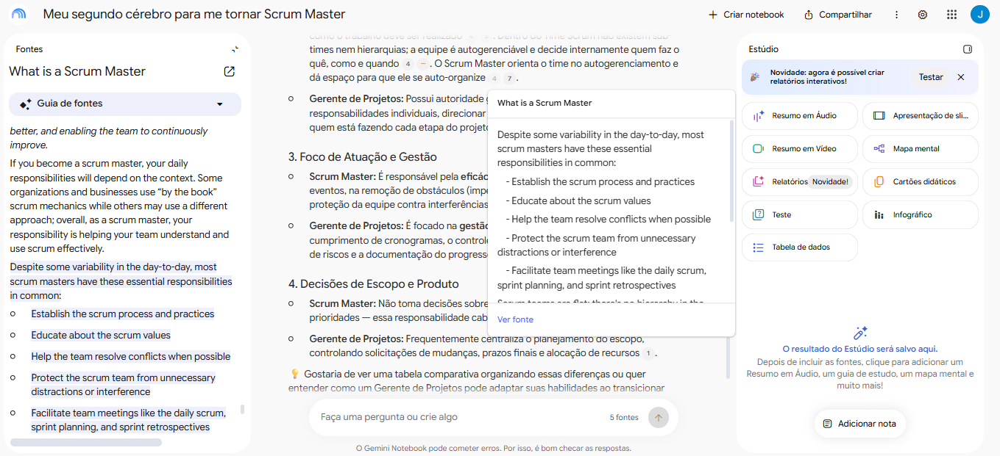
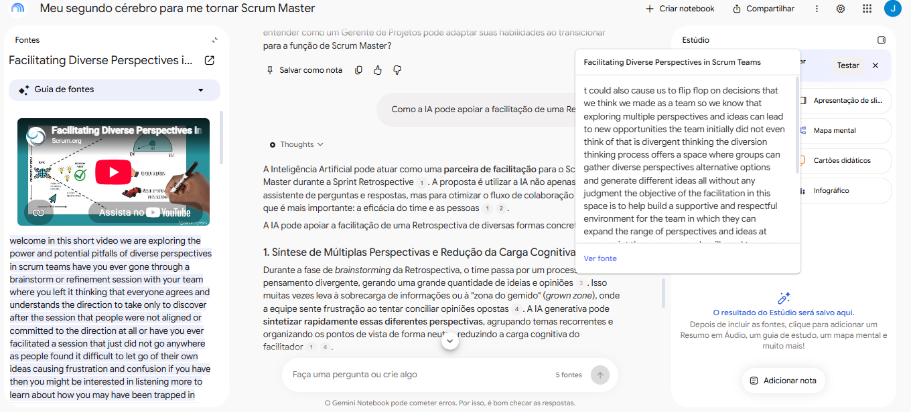
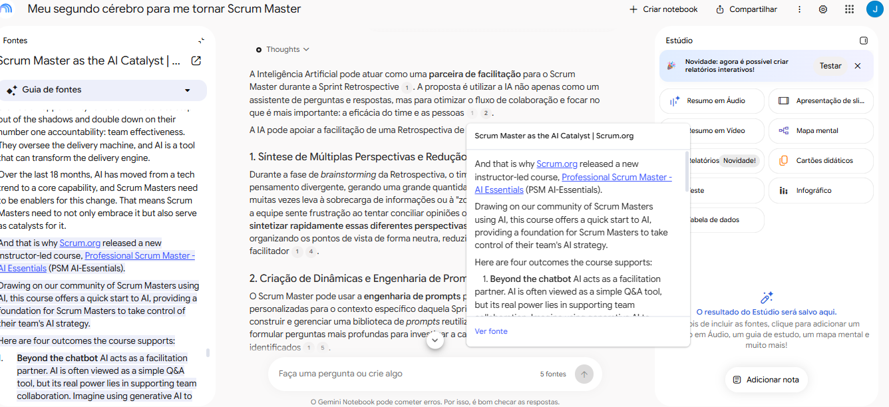

# segundo-cerebro-scrum-master
Segundo cerebro sobre Scrum Master no Gemini Notebook
# Meu segundo cérebro para me tornar Scrum Master

## TEMA E OBJETIVO

Quero um notebook especialista em Scrum que me ajude a me tornar Scrum Master, entendendo o framework, os eventos, os papéis e como a IA pode apoiar a facilitação do dia a dia.

## FONTES E POR QUE CONFIO NELAS

Critérios: autor reconhecido ou fonte oficial; conteúdo atualizado; cita referências ou se baseia no Scrum Guide.

**FONTES DE TEXTO:**

- O Scrum Guide (Schwaber e Sutherland) | https://scrumguides.org/scrum-guide.html | Guia oficial do framework, escrito pelos criadores do Scrum e base dos meus critérios

- O que é um Scrum Master? (Scrum Alliance) | https://www.scrumalliance.org/what-is-a-scrum-master | Organização oficial de Scrum, explica o papel e as responsabilidades do Scrum Master

- Scrum Master as the AI Catalyst (Scrum.org) | https://www.scrum.org/node/104547 | Artigo do Scrum.org (organização fundada pelo co-criador do Scrum), recente, sobre o papel do Scrum Master com IA

**FONTES DE VÍDEO:**

- Facilitating Diverse Perspectives in Scrum Teams (Scrum.org) | https://www.youtube.com/watch?v=iEdp6mYBv90&list=PLgDaZD8y4z0DE3hWcaOI3fbAUFkW7jYqV | Canal oficial do Scrum.org, aborda facilitação em times Scrum

- Eventos do Scrum (Scrum.org) | https://www.youtube.com/watch?v=LCrkRXVFJkQ&list=PLgDaZD8y4z0B3gggHyIf_acdpdtW8K_PE | Canal oficial do Scrum.org, explica os eventos do framework conforme o Scrum Guide

## DIRETRIZ DE COMPORTAMENTO

> Comporte-se como um especialista em Scrum e no papel de Scrum Master, cobrindo desde o início da carreira até o nível sênior. Eu sou iniciante e vou usar suas respostas como guia de estudo e trilha de boas práticas. Use um tom claro e didático, explicando os termos técnicos. Responda somente com base nas fontes do notebook e sempre indique de qual fonte veio cada informação. Se a resposta não estiver nas fontes, avise em vez de inventar.

## PERGUNTAS, RESPOSTAS E FONTES

### 1. O que faz um Scrum Master?

**Resposta (resumo):**

Estabelece o Scrum conforme o Scrum Guide e atua como líder servidor do time, do Product Owner e da organização. Suas responsabilidades:
- Time Scrum: coaching, remoção de impedimentos e facilitação dos eventos
- Product Owner: apoio na gestão do Product Backlog e no Product Goal
- Organização: apoio na adoção do Scrum e da abordagem empírica
- IA: atua como catalisador do uso de IA no time e nos eventos

**Fontes:** Scrum Guide, O que é um Scrum Master? (Scrum Alliance), Scrum Master as the AI Catalyst (Scrum.org)

**Evidência:**

### 2. Quais são os eventos do Scrum e qual o objetivo de cada um?

**Resposta (resumo):**

O Scrum define cinco eventos formais, criados para dar regularidade e permitir inspeção e adaptação contínuas:
- Sprint: evento contêiner que abriga os demais; dura no máximo um mês e entrega um incremento
- Sprint Planning: define o trabalho da Sprint (por quê, o quê e como); até 8h
- Daily Scrum: inspeciona o progresso rumo ao Sprint Goal e ajusta o plano do dia seguinte; 15 min
- Sprint Review: inspeciona o incremento com os stakeholders e define adaptações no Product Backlog; até 4h
- Sprint Retrospective: planeja melhorias na qualidade e na eficácia do time; até 3h

(Tempos para uma Sprint de um mês.)

**Fontes:** Scrum Guide

**Evidência:**

### 3. Qual a diferença entre um Scrum Master e um gerente de projetos?

**Resposta (resumo):**

A diferença está no modelo de liderança, na autoridade sobre a equipe e no foco:
- Liderança: o Scrum Master é líder servidor e coach do Scrum; o gerente de projetos tem liderança tradicional e diretiva, comum em projetos Waterfall
- Hierarquia: o Scrum Master não distribui tarefas, e o time se autogerencia; o gerente delega tarefas e acompanha quem faz o quê
- Foco: o Scrum Master cuida da eficácia do time (eventos, impedimentos, proteção); o gerente cuida do projeto todo (prazo, orçamento, riscos)
- Escopo: o Scrum Master não decide o que construir, isso é do Product Owner; o gerente costuma centralizar o planejamento de escopo

**Fontes:** O que é um Scrum Master? (Scrum Alliance)

**Evidência:**

### 4. Como a IA pode apoiar a facilitação de uma Retrospectiva?

**Resposta (resumo):**

A IA pode ser uma parceira de facilitação do Scrum Master na Retrospectiva, indo além do papel de assistente de perguntas e respostas:
- Sintetizar perspectivas: agrupa ideias e opiniões do brainstorming de forma neutra e reduz a carga cognitiva do facilitador
- Criar dinâmicas: usa engenharia de prompts e uma biblioteca de prompts reutilizáveis para o time
- Analisar dados: traz insights de métricas e históricos da Sprint para embasar as discussões
- Liberar o facilitador: ao delegar notas e resumos, o Scrum Master foca na mediação humana e na empatia
- Aplicar guardrails éticos: protege dados confidenciais e mitiga vieses dos modelos

**Fontes:** Facilitating Diverse Perspectives in Scrum Teams (Scrum.org, vídeo) e Scrum Master as the AI Catalyst (Scrum.org, artigo)

**Evidência:**

## MATERIAIS GERADOS

- Mapa mental: [mapa-mental-scrum-master.png](mapa-mental-scrum-master.png)
- Cartões didáticos (54 cartões): [cartoes-didaticos-scrum-master.csv](cartoes-didaticos-scrum-master.csv)
- A apresentação de slides estava indisponível no Gemini Notebook no momento da criação, por isso não foi gerada.

## LINK DO NOTEBOOK

https://notebook.google.com/notebook/8b6d8468-f540-4fbc-96d5-6bfb12669347 (abre com login em conta Google)
